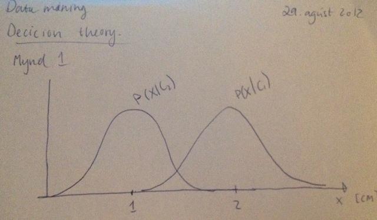
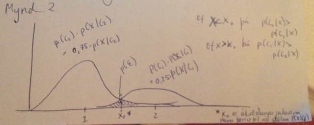

% Notes
% Jóhann Þorvaldur Bergþórsson & Stefanía Bjarney Ólafsdóttir
% 29. August 2012

# Decision Theory

## Problem formulation

Let's define a "state-of-nature" $C$ (e.g. $C_1$ or $C_2$) which describes an event that has happened. For example, $C_1$ is when the tumor under inspection is malignant and $C_2$ is when it is benign. Because the state of nature is so unpredictable we consider $C$ to be a variable that must be described probabilistically.

A-priori probability: $P(C_i)$ is the probability which reflects our prior knowledge of how likely $C_i$ occurs with any other source of information. If we have $C \in \{ C_1, C_2, \ldots, C_k \}$ then $\sum_{i=1}^k P(C_i) = 1$.

If 25% of tumors are malignant then $P(C_1) = 0.25$ and $P(C_2) = 0.75$.

If we have to make a decision with so little information it would seem logical to use the following decision rule:

> Decide $C_1$ if $P(C_1) > P(C_2)$. Otherwise decide $C_2$.

Normally we include a measurement $\x_n$ to improve our classifier. Different examples will give different readings and we express a probabilistic term. We assume the measurement is a continous random variable whose distribution depends on the state of nature and is expressed as $P(X|C)$. We call this **class-conditional probability density function**.

If we let $x$ be the diameter of the tumor then the difference between $P(x|C_1)$ and $P(x|C_2)$ describes the difference in diameter between malignant and benign tumors.

How does the knowledge of the measurement $x$ influence our attitude with respect to state of nature?

The joint probability of measuring $x$ and finding a pattern[^1], that is $C_j$ can be written in two ways
$$P(C_j, x) = P(C_j | x)P(x) = P(x|C_j)P(C_j)$$
$$P(C_j|x) = \frac{P(x|C_j)P(C_j)}{P(x)}$$

+ $P(C_j)$ is normally called *prior probability* and $P(C_j|x)$ is called *posterior probability*. $P(x|C_j)$ is called *class conditional* or likelyhood and $P(x)$ is called *evidence*.
$$P(x) = \sum_{i=1}^t P(x|C_i)P(C_i)$$
+ *Posterior probability*, $P(C_j|x)$ is the probability of the state of nature $C_j$ given that the feature vector value $\x$ has been measured.
+ *Likelihood (Class conditional probability density function)* indicates ...
+ *Evidence* $P(x)$ can be viewed as a scaling factor to ensure the posterior sums to one.

[^1]: pattern is synonym for state-of-nature.

If we have the posterior we can improve our decision rule:

> Decide $C_1$ if $P(C_1|\x) > P(C_2|\x)$, otherwise decide $C_2$.

We can justify this rule by looking at the probability of error. We know
$$P(\epsilon|\x) = \begin{cases}
    P(C_1|\x), &\text{if we decide } C_2 \\
    P(C_2|\x), &\text{if we decide } C_1
\end{cases}$$

$$P(\epsilon) = \int_{-\infty}^\infty P(\epsilon, x) dx = \int_{-\infty}^\infty p(\epsilon|x)p(x)dx$$

$$P(\epsilon|x) = \int_{-\infty}^{\infty} \min(P(C_1|x), P(C_2|x))dx$$

