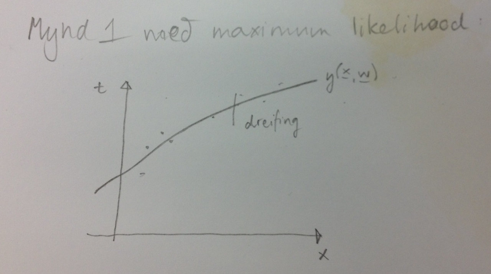
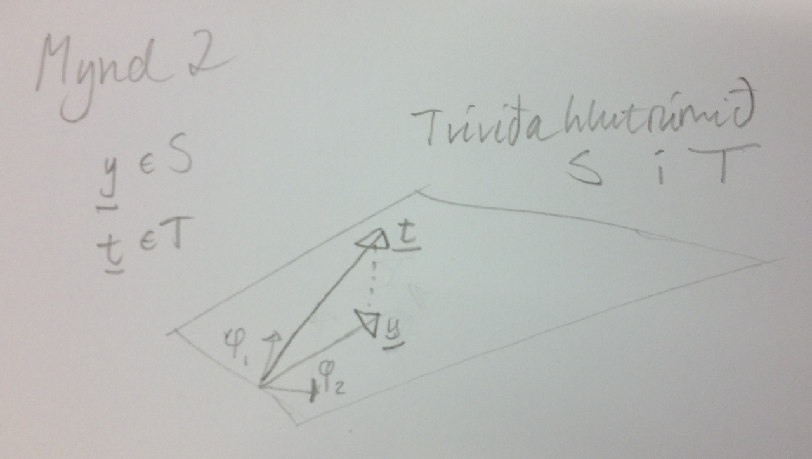

% Notes
% Jóhann Þorvaldur Bergþórsson & Stefanía Bjarney Ólafsdóttir
% 4. September 2012

# Decision Theory

If $p(C_1| \x) > p(C_2| \x)$ then choose $C_1$ otherwise choose $C_2$. This is equivilant to picking $C_1$ if $p(\x|C_1)p(C_1) > p(\x|C_2)p(C_2)$. Sometimes we define a classifier function with additional parameters $\vec{w}$:
$$y(\x, \vec{w}) = \begin{cases}
    0, &p(C_1|\x) > p(C_2|\x) \\
    1, &\text{else}
\end{cases}$$

# Linear Models of Regression

We are given a data set with $N$ observations $\{ \x_n \}_{n=1}^N$ together with corresponding target values $\{ t_n \}_{n=1}^N$. The goal is to predict $t$ for a new value of $\x$. Regression means that $t \in \R$.

The simplest linear model for regression is *also* linear (if we talk loosely about linerity and set $x_0 = 1$) in the input variables:
$$y(\x, \vec{w}) = w_0 + w_1 * x_1 + w_2 * x_2 + \dotsb + w_D * x_D$$
This is called **linear regression**. The key property is that this is also linear in the parameters $w_0, w_1, \dotsc, w_D$. Being linear in the input variable is very limiting. A more general model that is also tractable is only linear in parameters:
\begin{align*}
y(\x, \vec{w}) &= w_0 + w_1 \Phi_1(\x) + w_2 \Phi_2(\x) + \dotsb + w_{m-1} \Phi_{m-1}(\x) \\
&= \sum_{j=0}^{m-1} w_j \Phi_j(\x) = \vec{w}^T \vec{\Phi}(\x)
\end{align*}
where
$$\vec{w} = \begin{bmatrix}
    w_0 \\
    w_1 \\
    \vdots \\
    w_{m-1}
\end{bmatrix} \: \text{and} \:
\vec{\Phi}(\x) = \begin{bmatrix}
    \Phi_0(\x) \\
    \Phi_1(\x) \\
    \vdots \\
    \Phi_{m-1}(\x)
\end{bmatrix}$$

We call $\Phi_j(\x)$ are called **basis functions**, $\Phi_0(\x) = 1$ is a dummy basis function and $w_0$ is called a **bias parameter**. This is not a statistical bias but more of a method that allows to to shift the data.

## Maximum likelihood and least squares

We assume that the target values are reached by the model plus noise:
$$t = y(\x, \w) + \epsilon$$
Assume that
$$p(\epsilon|\beta) = \NormalDist(\epsilon|0, \beta^{-1})$$

This is equivalent to saying
$$p(t, \x, \w, \beta) = \NormalDist(t | y(\x, \w), \beta^{-1})$$
In general we call $\frac{1}{\sigma}$ **precision**.

So for a dataset $\X = \{ \x_1, \x_2, \dotsc, \x_N \}$ and targets $\vec{t} = [t_1, t_2, \dotsc, t_N]^T$ we get the likelihood function
$$p(\vec{t} | \X, \w, \beta) =\prod_{n=1}^N \NormalDist(t_n|\w^T \vec{\Phi}(\x_n), \beta^{-1})$$
The **log likelihood** is then
\begin{align*}
    \mathcal{L} &= \sum_{n=1}^N \ln \NormalDist(t_n|\w^T \vec{\Phi}(\x_n), \beta^{-1}) \\
    &= \frac{N}{2}\ln(\beta) - \frac{N}{2}\ln(2\pi) - \beta E_D(\w)
\end{align*}
where
$$E_D(\w) = \frac{1}{2}\sum_{n=1}^N ( t_n - \w^T \vec{\Phi}(\x_n))^2$$
is the **sum of squares error function.**

If we take the gradient and set it to zero we get
\begin{align*}
    \nabla_{\w} \ln(p(\vec{t}| \x, \w, \beta)) &= \beta \sum_{n=1}^N (t_n - \w^T \vec{\Phi}(\x_n)) \vec{\Phi}(\x_n)^T\\
    &= 0
\end{align*}
we get
$$\w_{ML} = (\Phi^T \Phi)^{-1} \Phi^T \vec{t}$$
where
$$\Phi = \begin{bmatrix}
    \Phi_0(\x_1) & \Phi_1(\x_1) & \cdots & \Phi_{M-1}(\x_1) \\
    \Phi_0(\x_2) &\ddots & & \vdots \\
    \vdots & & \ddots & \vdots \\
    \Phi_0(\x_N) & \cdots & \cdots & \Phi_{M-1}(\x_n)
\end{bmatrix}$$

# Geometry of least squares

What does the output "look like" when we use our estimate of the parameters?

$$\y = \Phi \w_{ML}=[\phi_1, \phi_2, \dotsc, \phi_M] \w_{ML} = \begin{bmatrix}
    \Phi_0(\x_1) & \cdots & \Phi_{M-1}(\x_1) \\
    \vdots & \ddots & \vdots \\
    \Phi_0(\x_n) & \cdots & \Phi_{M-1}(\x_n)
\end{bmatrix} \w_{ML}$$

So $\y$ is an $M$ dimensional subspace spanned by $\phi_1, \phi_2, \dotsc, \phi_M$, $\y \in S \subseteq T$, $t \in T$.

With arbitrary $\w$, $\y$ can be anywhere in $S$ but $\w_{ML}$ positions $\y$ to be as close to $\t$ as possible. I.e $\y$ is an orthogonal projection of $\t$ onto $S$, the space spanned by the nonlinear transform of the input.