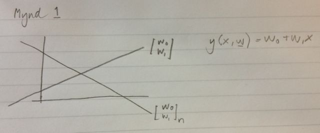

% Notes
% Jóhann Þorvaldur Bergþórsson & Stefanía Bjarney Ólafsdóttir
% 5. September 2012

# Linear Models for Regression

$$y(\x, \w) = \sum_{j=0}^{M-1} w_j \phi_j(\x) = \w^T \Phi(\x)$$

If we are given a training set $\{ \x_n \}_{n=1}^N$ and $\{ t_n \}_{n=1}^N$ then the ML estimate of $\w$ is
$$\w_{ML} = (\Phi^T\Phi)^{-1} \Phi^T \t$$

# Sequential Learning

So far we have determined the parameters of the model from $N$ observations. This is called **batch processing** or **offline learning**.

**Sequential processing** or **online learning** is when we update the estimate for the parameters as new data arrives. An example of this is stochastic gradient descent
$$\w^{(\tau + 1)} = \w^{(\tau)} - \eta \grad E = \w^{(\tau)} - \eta (t_n - \w^{(\tau)} \Phi(\x_n))\phi(\x_n)$$
This is known as **least-means-squares algorithm**. $\eta$ is a parameter that controls the rate of update for $\w$.

# Regularized least squares

Overfitting can be a problem as we saw in Chapter 1. To control overfitting a regularization term is added to the error function.
$$\underbrace{E_D(\w)}_{\text{data term}} + \underbrace{\lambda E_{\w}(\w)}_{\text{regularization term}}$$

With a sum-of-squares error function and a quadratic regularizer we get
$$\frac{1}{2}\sum_{n=1}^N \{t_n - \w^T \Phi(\x_n) \}^2 + \frac{\lambda}{2} \w^T \w$$
which is minimized by
$$\w = (\lambda \I + \Phi^T \Phi)^{-1} \Phi^T \t$$

# Bayesian linear regression

After our treatment using ML we are left with the problem of choosing what $\lambda$ should be. This can be solved using hold-out data.

Instead we can turn to Bayesian treatment of linear regression. Bayesian estimate of parameters treats them as random variables.

## Parameter distribution

Let's define a conjugate prior
$$p(\w) = p(\w|\vec{m}_0, \vec{S}_0) = \NormalDist(\w| \vec{m}_0, \vec{S}_0)$$
We can choose $\vec{m}_0$ and $\vec{S}_0$ depending on the problem but a common choice is $\vec{m}_0 = \0$ and $\vec{S}_0 = \alpha^{-1} \I$. So we have
$$p(\w) = p(\w|\alpha) = \NormalDist(\w| \0, \alpha^{-1}\I)$$
We are trying to find the posterior distribution (which is $\propto$ likelihood $\times$ prior).
$$p(\w|\t) \propto p(\t|\w) p(\w)$$
We can plug $\NormalDist(\x| \mvmean, \mvSigma)$ into this formula but the general result has been done in Chapter 2.
$$p(\t|\w) = \NormalDist(\w | \vec{m}_N, \vec{S}_N)$$
where
$$\vec{m}_N = \vec{S}_N(\vec{S}_N^{-1}\vec{m}_0 + \beta \Phi^T \t) = \beta \vec{S}_N \Phi^T \t$$
and
$$\vec{S}_N^{-1} = \vec{S}_0^{-1} + \beta \Phi^T \Phi = \alpha \I + \beta \Phi^T \Phi$$

