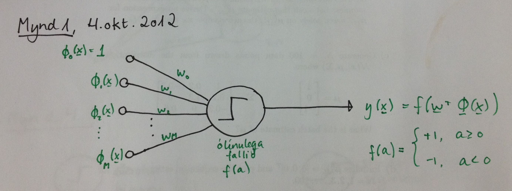

% Notes
% Jóhann Þorvaldur Bergþórsson & Stefanía Bjarney Ólafsdóttir
% 4. October 2012

Neural Networks
==================================

Artificial Neural Networks are mathematical representation of the information processing in biological systems. We are going to restrict ourselves to a specific class of neural networks that have proven to be of greatest practical value in machine learning - *multilayer perceptron*.

We will look at

1. Architecture description.
2. Network training, especially the *back propagation algorithm*.

The perceptron
---------------------------------
We have from chapter 4.17 the formulation for the perceptron  (í. taugungur)
$$y(\x) = f(\w^T\phi(\x))$$
where
$$f(a) = \begin{cases} 1, &a \ge 0 \\
-1, &a < 0\end{cases}.$$
It was shown how to determine the weights using the *perceptron criterion*.

The perceptron can be depicted graphically by

<!--  -->

This can be referred to as a single layer perceptron.

The question is how to construct the basis functions $\phi_m(\x)$ so that the parameters can also be adapted.

One way is to use another perceptron, i.e.

<!--  -->

As a result we ge a *multilayer perceptron*.

<!--  -->

For the back propagation algorithm to work, the activation functions $f$ need to be differentiable. Popular choices for $f$ are the sigmoid function  or $\tanh$.

<!--  -->

Notations and definitions
--------------------------------

<!--  -->

We have $M$ linear combinations of the input variables $x_1, x_2, \dotsc, x_D$:
\begin{align*}
    a_j &= \sum_{i=1}^{D} w_{ji}^{(1)} x_i + w_{j0} \\
    \a^{(1)} &= \W^{(1)} \tilde{\x}
\end{align*}
where
$$\tilde{\x} = \begin{bmatrix}
    1 \\ x_1 \\ \vdots \\ x_D
\end{bmatrix}$$
Each of these are transformed using differentiable, non linear *activation functions*, $h(\dot)$ so that
$$z_j = h(a_j)$$
These are called *hidden units*. Typically we use logistic sigmoid or $\tanh$. The output unit activation is given by
\begin{align*}
    a_k &= \sum_{j=1}^{M} w_{kj}^{(2)} z_j + w_{k0}^{(2)} \\
    \a^{(2)} &= \W^{(2)} \tilde{\z}
\end{align*}
where
$$\tilde{\z} = \begin{bmatrix}
    1 \\ z_1 \\ \vdots \\ z_M
\end{bmatrix}$$
and $k=1, \dotsc, K$ where $K$ is the total number of outputs.

Finally this is transformed via the *output activation function*. Typically two choices:

1. Regression $y_k = a_k$.
2. Classificiation $y_k = \sigma(a_k)$ or $y_k = \tanh(a_k)$.

<!--  -->

If we include the bias into the summation (like we did in Ch. 3) then the $k$-th output of a feed-forward neural network is given by
$$y_k(\w, \w) = \sigma \left (\sum_{j=0}^{M} w_{kj}^{(2)} h \left (\sum_{i=0}^{D} w_{ji}^{(1)} x_i \right )   \right)$$
Using vector notation (and taking $\sigma(\dot)$ and $h(\dots)$ to mean element wise operation) we have
$$\y(\x, \w) = \sigma \left( \W^{(2)} [ h(\W^{(1)} \tilde{\x})] \right )$$

